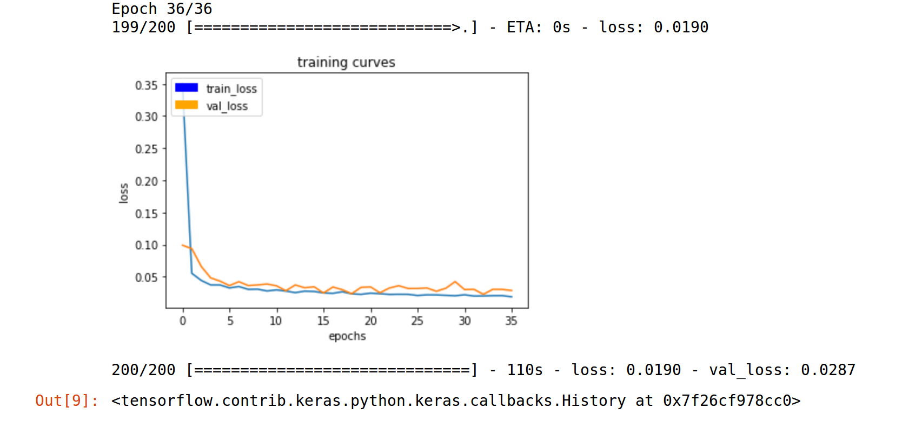
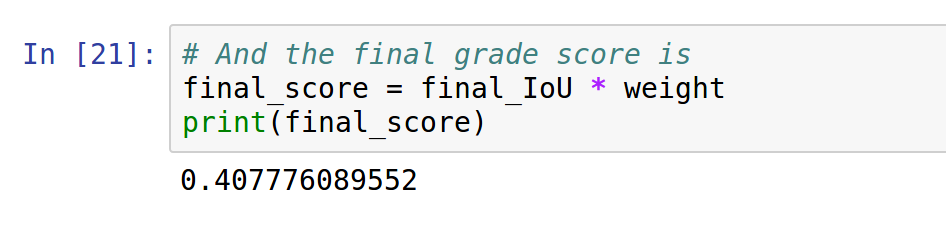
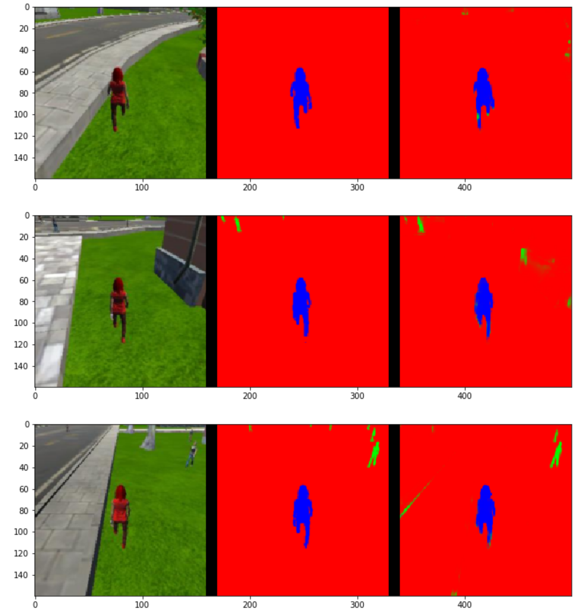
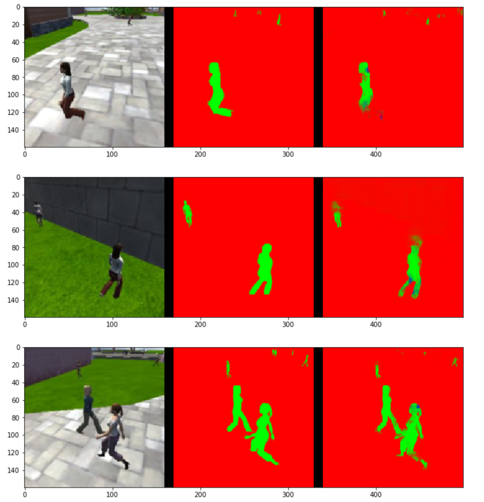
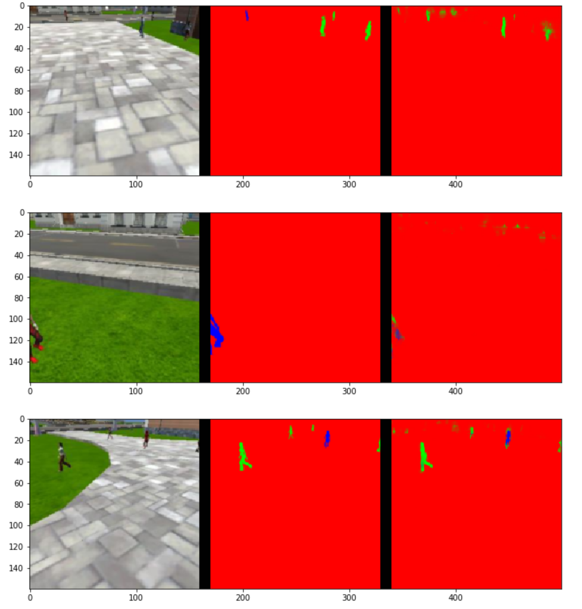

# Follow Me Project

### Fully Convolutional Neural Network

A traditional convolutional neural network consists of a series of
convolutional layers followed by some fully connected layers and finally, some
activation function. They are good at answering questions such as, is there a
car in this image? A Fully Convolutional Neural Network (FCN) extends this to
answer the question, where in this image is the car? This is important in the
Follow Me project as we are wanting to follow our hero and to do this, we must
be able to identify where in our field of view the hero is and adjust our
heading accordingly. I will briefly explain some of the theory (including code
samples where appropriate) before discussing my implementation.

#### Pooling

Pooling is generally used to decrease the resolution of the output of a layer
and can also prevent over fitting. We covered a few different types of pooling;
max pooling and average pooling. Max pooling looks at the values of the pixels
in the pool and chooses the max value. Average pooling takes the average of all
the values in the pool. In both cases, the new value is representative of all
pooled pixels in the pooling layers output.

#### Separable Layers

A filter is separable if it can be expressed as the output of two vectors. We
can do this because of the property of associativity which states that
`f * (v* h) = (f * v) * h`.  The main reason for doing this is performance (or rather a
reduction of arithmetic operations). Consider filtering an M by N image with a
P by Q kernel, we would need `MNPQ` many multiplication and add operations
(using fast Fourier transforms changes this but I didn't explore the
implications). Separating the two operations yields `MNP` many multiplication
and add operations for the first step and `MNQ` many for the second step. The
total can be expressed as `MN(P+Q)`. Expressed another way, we save `PQ/(P+Q)`
many operations by separating the layers.

```python
def separable_conv2d_batchnorm(input_layer, filters, strides=1):
    output_layer = SeparableConv2DKeras(filters=filters, kernel_size=3, strides=strides,
                                        padding='same', activation='relu')(input_layer)
    output_layer = layers.BatchNormalization()(output_layer)
    return output_layer
```

#### Skip Connections

Encoding layers split the image down into smaller sub-images that can be used
to identify sub features in the images. A by product of this is that we lose
scope on the larger scene. We can combat this by using skip connections. A skip
connection is a connection from the output of one layer into the input of a non
adjacent layer.  In this way, a convolution will be able to combine information
from both resolutions and learn from the composite thus the spatial information
is better retained (eg. in our decoder).

#### Fully Connected Layer

The fully connected layer allows us an easy way to combine features from
preceding convolutional layers in a cheap way. It has a limitation that
the input must be a certain size which constrains the size of the images
that can be fed into the network. 1x1 convolutions remove this constraint.

#### 1x1 Convolutions

A 1x1 convolution is a convolution with certain characteristics:

* `1 * 1 * filter_size` (HxWxD)
* `stride = 1`
* `same` padding.

1x1 convolution helps in reducing the dimensionality of the layer. A
fully-connected layer of the same size would result in the same number of
features. However, replacement of fully-connected layers with convolutional
layers presents an added advantage that during inference (testing your model),
we can feed images of any size into your trained network.

They can also provide our network with some other useful benefits; if we have a
normal convolutional layer looking at an `N*N` patch of the image then it can be
reasoned as a linear classifier. If we add the 1x1 convolutional layer to the
output then we de-linearise it by turning it into a neural network. The more
1x1 convolutions we add the more parameters we have to tweak during training.

#### Bilinear Upsampling

The bilinear upsampling layer doesn't actually learn like transposed
convolutions but does help speed up performance.

```python
def bilinear_upsample(input_layer):
    output_layer = BilinearUpSampling2D((2, 2))(input_layer)
    return output_layer
```

#### Batch Normalisation

Batch normalisation is the practice of normalising all the inputs to each layer
of the network rather than just the data at its initial entry. The name comes
from the technique using the current batch of data (see `batch_size` in the
hyper parameters section).

```python
def conv2d_batchnorm(input_layer, filters, kernel_size=3, strides=1):
    output_layer = layers.Conv2D(filters=filters, kernel_size=kernel_size, strides=strides,
                      padding='same', activation='relu')(input_layer)
    output_layer = layers.BatchNormalization()(output_layer)
    return output_layer
```

### FCN Implementation

My fully convolutional network consists of three encoder blocks, starting with
a depth of 32 and doubling each time. These attempt to capture the features
present in the image. These are then connected to three decoder blocks via a
batch normalised 1x1 convolutional layer. The decoder blocks upsample our deep
layers back to a flatter representation and attempt to identify the encoded
features in the resultant image. This is how we add spatial information back
into our network.


```python
def fcn_model(inputs, num_classes):
    # Remember that with each encoder layer, the depth of your model (the number of filters) increases.
    en1 = encoder_block(inputs, 32, 2)
    en2 = encoder_block(en1, 64, 2)
    en3 = encoder_block(en2, 128, 2)

    cv1 = conv2d_batchnorm(en3, filters=16, kernel_size=1, strides=1)

    dc3 = decoder_block(cv1, en2, 32)
    dc2 = decoder_block(dc3, en1, 64)
    dc1 = decoder_block(dc2, inputs, 128)

    x = dc1
    return layers.Conv2D(num_classes, 1, activation='softmax', padding='same')(x)
```

#### Encoder Blocks

Encoders break the image down into smaller resolution, deeper feature spaces
and attempt to identify features.

This allows us to learn about features more complicated than just lines
or curves. For example we can begin to recognise things such a hand, nose, or
eyes.

```python
def encoder_block(input_layer, filters, strides):
    return separable_conv2d_batchnorm(input_layer, filters, strides)
```

Our encoder blocks are thus separable convolutions whose final output is batch
normalised.

#### Decoder Blocks

Decoder blocks take the output of the encoders and attempt to find the learnt
features in higher resolution images. Doing so provides us with the extra
spacial information we require for semantic segmentation.

We can improve the performance of decoding by including skip connections that
provide the decoder block with extra spatial information as discussed in the
skip connections section.

One of the problems with decoders is the method of upsampling the encoded
feature as we need to project this onto a higher resolution image, we can
introduce visual artifacts such as the checkerboard problem.

```python
def decoder_block(small_ip_layer, large_ip_layer, filters):
    upsampled = bilinear_upsample(small_ip_layer)
    merged = layers.concatenate([upsampled, large_ip_layer])
    output_layer = separable_conv2d_batchnorm(merged, filters)
    return output_layer
```

In the code above, the decoder block comprises of bilinear upsampling of the
`small_ip_layer` which is then concatenated with `large_ip_layer`. We then add
a separable convolutional layer to help learn spatial details from the input
layers.

#### Hyper Parameters

```python
learning_rate = 0.001
batch_size = 20
num_epochs = 36
steps_per_epoch = 200
validation_steps = 50
workers = 2
```

The `learning_rate` was chosen to be what I considered to be a reasonable
value. I iterated the other values around it and didn't change it (permuting
too many of the hyper parameters with a dev-test cycle of up to an hour is not
very efficient). It is possible however that a value as small as the one I have
chosen would allow for getting stuck in a local minimum. In practice, testing
the order of magnitude of this value would be advisable.

I chose a batch size of 20 because I was constrained by the amount of memory I
had available on my GPU (GTX1050). I did some runs on another machine with a
GTX1070 where I used a `batch_size` of 30. The `batch_size` is the number of
training samples that get put through the network in a single pass.  If the
product of `batch_size * num_epochs * steps_per_epoch` is the same the model
will see the same total number of training samples and so should get similar
results.

`num_epochs` was determined by trial and error - initially I had this set to 50
however only produced a result of 39%. I had a look back over the previous
iterations to find one where stopping might produce a better result and thus
tried 36. For interests sake I actually trained models with up to 400 epochs
but didn't see any improvements in the IoU score (in fact I think we would be
getting into over fitting territory with that many epochs).

#### Results

| Final Epoch of Training | IoU Score |
| --- | --- |
|  |  |
| Final epoch of training yields `loss` of `0.0190` and `val_loss` of `0.0287`. | My model manages to achieve a final score of `40.77`, there is obviously significant room for improvement which is discussed in the Future Enhancements section below. |

| Following | Patrolling (no hero) | Patrolling (hero visible) |
| --- | --- | --- |
|  |  |  |

We can see here that the model does a pretty good job of recognising the hero when it is following with an IoU score of `88.04`.

The model performs worse when we are patrolling around looking for the hero.
The validation for this scenario saw `68` false positives. Training over more
data with the hero in more poses would help reduce this however I don't think
it would be possible to remove all of the false positives with the masks
configured as they are as some features of the hero are shared by other people
and when viewed in isolation are indistinguishable.


Finally, when we are patrolling and the target is visible somewhere in the
frame we perform quite poorly with and IoU for the hero as `20.57` and;
number true positives: 145, number false positives: 3, number false
negatives: 156

The model could have benefited greatly from having a lot more data with the
hero placed further out in the image.

## Model Reuse

This trained model is not reusable for following another object such as a dog
or a car. Images containing the desired objects would need to be captured and
masks applied before being fed into the network. The resultant model could then
be used to follow that new object.

## Future Enhancements

**One of the best improvements we could make to my model is to train it on a
larger, more comprehensive data set**. I actually attempted to capture more data
of my own but the drone ignored the hero in training mode.

Another enhancement would be to explore **adding more layers to further our
ability to recognise more subtle features of the hero however in this
particular instance, we are limited by the number of discernible features our
hero is rendered with in the simulator**. In a real life implementation the model
could learn to recognise the hero based on more subtle facial features etc
rather than the spatial and color heavy features in the simulator. Other students
actually pointed out that it is possible for the model to incorrectly classify a
hand in the frame as the hero if it has been trained on images with hands in the edges
with masks indicating it is the hero.

I didn't iterate values for the learning rate which obviously would have a huge
impact on the resulting model. **Without having tried a multitude of values for
the learning rate it is possible my model has ended up in a local minimum** and
the learning rate is not sufficient to overcome it.

I could have added skip connections to improve the spatial information
available in the network and improve decoder performance.

